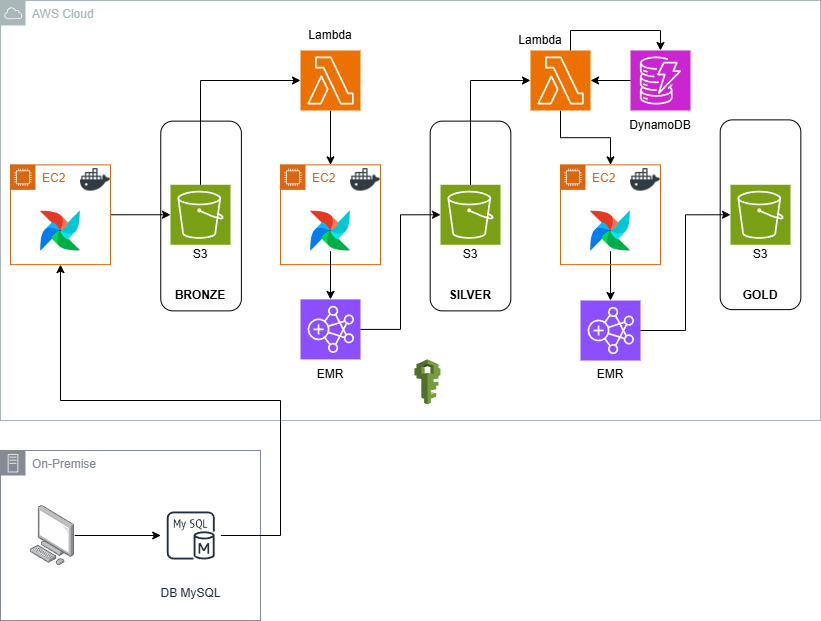

# Criando um Data Lake na AWS
## Índice
- [Resumo](#resumo)
- [Objetivo](#Objetivo)
- [Arquitetura AWS utilizada](#arquitetura-aws-utilizada)
- [Ferramentas e linguagens utilizadas](#ferramentas-e-linguagens-utilizadas)
- [Preparação do SGBD](#preparação-do-SGBD)
- [Criação e estruturação do Bucket S3](#criação-e-estruturação-do-Bucket-S3)
- [Grupo de segurança e usuário IAM](#Grupo-de-segurança-e-usuário-IAM)
- [Criação da instância EC2](#criação-da-instância-EC2)
    - [Acessando a instância EC2 via SSH](#acessando-a-instância-EC2-via-SSH)
    - [Criação da pasta scripts](#criação-da-pasta-scripts)
    - [Instalação do AWS CLI na instância EC2](#instalação-do-AWS-CLI-na-instância-EC2)
    - [Configurar AWS CLI na Instância EC2](Configurar-AWS-CLI-na-Instância-EC2)
- [Transferência das DAGs](Transferência-das-DAGs)
- [Camada Bronze](Camada-Bronze)
- [Camada Silver](Camada-Silver)
- [Camada Gold](Camada-Gold)


## Resumo
&nbsp;&nbsp;&nbsp;&nbsp;&nbsp;&nbsp;Esse projeto é referente a criação de um Data Lake utilizando a Cloud AWS, tudo em um Pipeline gerenciado pelo Apache Airflow.

## Objetivo
Criar e entregar de forma automática books de variáveis para consumo de cientistas de dados, reduzindo tempo e minimizando erros ao reduzir interferência humana.

## Arquitetura AWS utilizada<br>



## Ferramentas e linguagens utilizadas
- <span lang="en">python</span>
- SQL
- PySpark
- MySql
- Docker
- Linux
- Jupyter Notebook
- AWS S3
- AWS EC2
- AWS Lambda
- AWS DynamoDB

## Preparação do SGBD
&nbsp;&nbsp;&nbsp;&nbsp;&nbsp;&nbsp;O SGBD utilizado para esse projeto foi o MySql, criado um DataBase e alimentado com essas [tabelas](dados/tabelas.zip) (users, products, sales). As tabelas foram criadas com a biblioteca Faker do python, a tabela sales que contém os registros das vendas é a mais extensa, com 500.000 registros até o momento, de 01/01/2021 à 31/09/2024.

## Criação e estruturação do Bucket S3
A estrutura no Bucket S3 utilizada é a seguinte: <br>


- **0000_bronze:** primeira camada do Data Lake, arquivos brutos exatamente como da fonte;
- **0001_silver:** segunda camada do Data Lake, arquivos da camada bronze com tratamento;
- **0002_gold:** terceira camada do Data Lake, books de variáveis prontos para serem utilizados pelos cientistas de dados;
- **0003_controle:** arquivos de controle dos processos entre as camadas;
- **0004_codes:** onde estarão armazenadas as Dags de uso do Airflow e scripts utilizados pelos EMR's;
- **0005_logs:** onde ficarão armazenados os Logs registrados pelos EMR's.

## Grupo de segurança e usuário IAM
&nbsp;&nbsp;&nbsp;&nbsp;&nbsp;&nbsp;Seguindo as orientações da AWS um grupo de usuários foi criado contendo as permissões necessárias para o projeto e vinculado a ele um usuário com chaves de acesso para acessar o AWS CLI que é [instalado](#Instalação-do-AWS-CLI-na-instância-EC2) posteriormente.

## Criação da instância EC2
&nbsp;&nbsp;&nbsp;&nbsp;&nbsp;&nbsp;O tipo de instância utilizada foi uma m5.xlarge com sistema operacional Ubuntu e par de chaves .pem (faça o download da chave em um local que lembre posteriormente), a instância possui uma função IAM com  políticas que permitem criação e acessso a clusters EMR e transferência de funções IAM específicas para esses cluster criados. Conforme boas práticas lembre-se de sempre utilizar funções com o menor privilégio necessário para uma maior segurança.

### Acessando a instância EC2 via SSH
- Primeiro liberar a porta 22 para o **IP público local** no grupo de segurança vinculado a instância EC2.
- Acessando a instância EC2 via prompt, é necessário navegar até o caminho onde a chave.pem foi armazenada e execute o comando:
```bash
ssh -i "chave_criada.pem" ubuntu@DNS_publico
```

### Criação da pasta scripts
&nbsp;&nbsp;&nbsp;&nbsp;&nbsp;&nbsp;Foi criada uma pasta **script** na instância EC2, onde foi transferido 3 arquivos:
- [Instalação Docker e Airflow](bash/install_docker_airflow.sh) **:** para instalação do Docker e Airflow na instância EC2;
- [Download da Dags do S3](bash/download_files.sh) **:** para transferir do S3 prara o EC2 as DAGs que serão utilizadas no Airflow.
- [Config](bash/config.cfg) **:** onde estão armazenadas as informações de acesso do mysql local e chave de acesso do usuário IAM

### Instalação Docker e Airflow
- De permissão para executar o arquivo
```bash
chmod +x /home/ubuntu/scripts/install_docker_airflow.sh
```

- Após conceder a permissão execute o arquivo.
```bash
./install_docker_airflow.sh
```

- Ao finalizar a instalação, na pasta ~/airflow execute o comando para iniciar o contêiner
```bash
sudo docker compose up -d
```
- Liberada a porta 8080 no grupo de segurança vinculado a sua instância EC2
- Acessando no navegador através do endereço: **dns_publico_da_instância:8080** ;
- O usuário e senha são **airflow** para ambos.

### Instalação do AWS CLI na instância EC2
&nbsp;&nbsp;&nbsp;&nbsp;&nbsp;&nbsp;Para acessar o bucket S2 através da instância EC2 é necessário a instalação do CLI, mas primeiro é necessário instalar 2 ferramentas:
- **unzip**: para descompactar arquivos .zip;
- **curl** : ferramenta para fazer requisições HTTP e baixar arquivos URLs
```bash
sudo apt-get install -y unzip curl
```
- baixe o arquivo de instalação
```bash
sudo apt-get install -y unzip curl
```
- descompactar o arquivo
```bash
unzip awscliv2.zip
```
- instalar o arquivo
```bash
sudo ./aws/install
```
- confirmar a instalação verificando a versão
```bash
aws --version
```
### Configurar AWS CLI na Instância EC2
Execute o comando:
```bash
aws configure
```
Registrando o usuário IAM através dos seguintes parâmetros solicitados: <br>
AWS Access Key ID = *********** <br>
AWS Secret Access Key = *********** <br>
Default region name = região que está utilizando <br>
Default output format = .json <br>

## Transferência das DAGs
&nbsp;&nbsp;&nbsp;&nbsp;&nbsp;&nbsp;Foram utilizadas um total de 7 DAGs para o projeto, divididas em 3 grupos: <br>
- [Ingestão](DAGs/bronze) _ responsáveis pela etapa de extração do MySQL e ingestão na camada bronze no formato **CSV** ;
- [Processamento](DAGs/silver) _ responsáveis pela etapa de tratamento dos dados da camada bronze, alteração do formato para **parquet** e finaliza transferindo os dados para a camada silver;
- [Book](DAGs/gold) _ responsável pela etapa de criação do book de variáveis e armazenamento na camada gold.<br>
- DAGs salvas no S3 em codes/dags.
- executando o comando na instância para realizar o download das DAGs do S3 para a pasta airflow/dags/ na instância.
```bash
./download_files.sh
```

**OBS.:** as DAGs das camadas de ingestão e processamento são um total de 3 para cada etapa, porém como em cada camada o que muda é apenas a tabela(assunto), irei deixar anexado apenas um exemplo para cada camada, no caso "products". 

## Camada Bronze
&nbsp;&nbsp;&nbsp;&nbsp;&nbsp;&nbsp;Em cada camada irei relatar um resumo do processo. <br>
&nbsp;&nbsp;&nbsp;&nbsp;&nbsp;&nbsp;Na camada bronze, os dados do mysql Local são acessados pela instância EC2, transformados para csv e armazenados no S3 (camada bronze). <br>
**Detalhes importantes:**
- Os dados de acesso do banco mysql e da chave de acesso do usuário IAM devem estar corretos no arquivo [Config.cfg](bash/config.cfg)
- O IP público da instância deve estar liberado no firewall e roteador local.

## Camada Silver
&nbsp;&nbsp;&nbsp;&nbsp;&nbsp;&nbsp;Cada pasta da camada bronze é monitorada por uma Lambda específica, que na chegada do arquivo aciona a [DAG_silver](DAGs/silver/process_products_silver.py) que da início ao processo da camada silver, criando um cluster EMR com um step job que executa o arquivo de [script_silver](codes/cd_products_process.py) da camada silver, script resonsável pelo tratamento dos dados, tranformação para o formato parquet e armazenamento na camada silver.<br>
**Detalhes importantes:**
- Nessa DAG foi necessário vincular um [arquivo(install_boto3)](bash/install_boto3.sh) bash responsável pela instalação do boto3 no cluster EMR.
- Nesse script, é feita uma verificação para selecionar o arquivo csv mais recente na pasta bronze.

## Camada Gold
&nbsp;&nbsp;&nbsp;&nbsp;&nbsp;&nbsp;Diferente da camada silver, para essa etapa teremos apenas uma Lambda monitorando a chegada de 3 arquivos das pastas (silver/users, silver/products, silver/sales).<br> 
&nbsp;&nbsp;&nbsp;&nbsp;&nbsp;&nbsp;Para que isso funcionasse foi necessário utilizar o DynamoDB, que teve uma tabela auxiliar criada com duas colunas: **ID** para identificar o assunto e **status** para informar se o arquivo foi recebido ou está pendente.<br> 
&nbsp;&nbsp;&nbsp;&nbsp;&nbsp;&nbsp;Então a cada arquivo que chega na camada silver a Lambda é aciona a altera o status (para recebido) na tabela auxiliar referente ao assunto. <br>
&nbsp;&nbsp;&nbsp;&nbsp;&nbsp;&nbsp;Após os 3 arquivos chegarem, o que transforma o status de todos para recebido na tabela auxiliar, nesse momento a Lambda altera novamente toda a coluna status para pendente e enfim aciona a [DAG_gold](DAGs/gold/creation_book_gold.py) responsável pela camada Gold, criando um cluster EMR com o step job que executa o [script](codes/cd_sales_book.py).<br>
&nbsp;&nbsp;&nbsp;&nbsp;&nbsp;&nbsp;Esse script é responsável pela criação do book de variáveis executando as seguintes etapas:
- Nele é especificado data (30/09/24) e período(12 meses) da REF, nesse caso o book terá início na data menciona olhando 12 meses anteriores.
- Nessa etapa, para resgatar os dados da camada silver é feito o processo de deduplicação utilizando a data e período especificados.
- Após a leitura e deduplicação das bases sales e products da camada silver é feita a união de sales com a coluna product_category de products.
- Criação das Flags de tempos utilizadas, no caso último mês, últimos 3 meses, últimos 6 meses e últimos 12 meses;
- E a criação da variáveis, no script como exemplo foi criado diversas variáveis, mas dependendo do assunto e demanda do negócio elas são alteradas, por exemplo churn não terá as mesmas variáveis que para fraude. **Esse Book de exemplo tem um total de 203 colunas.**
- O Book é salvo na camada Gold no formato parquet, onde se torna pronto para consumo pelos cientistas de dados.
- Nessa etapa um grupo de segurança é criado para os cientistas de dados terem acesso somente a pasta e arquivos específicos do book de variáveis.


  
